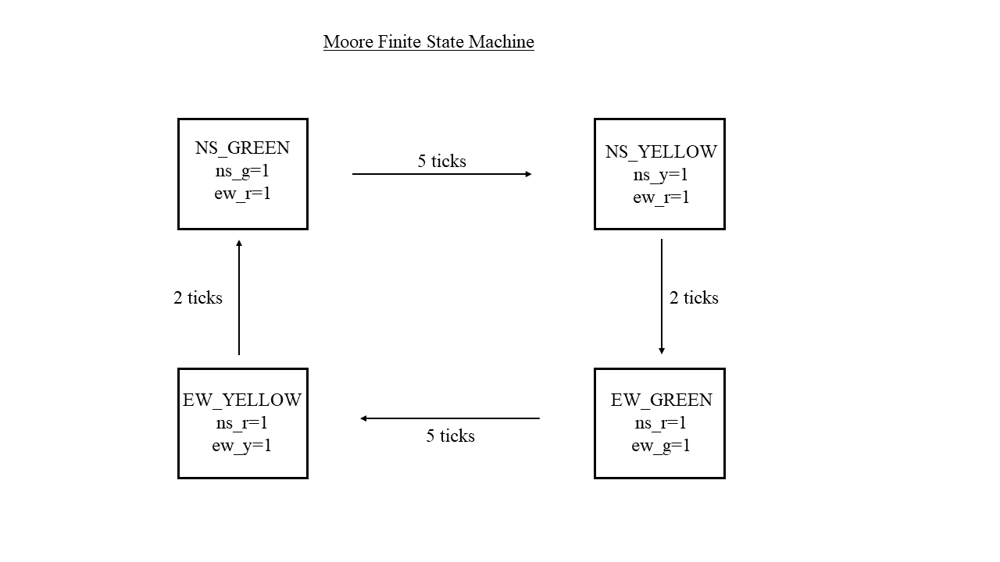
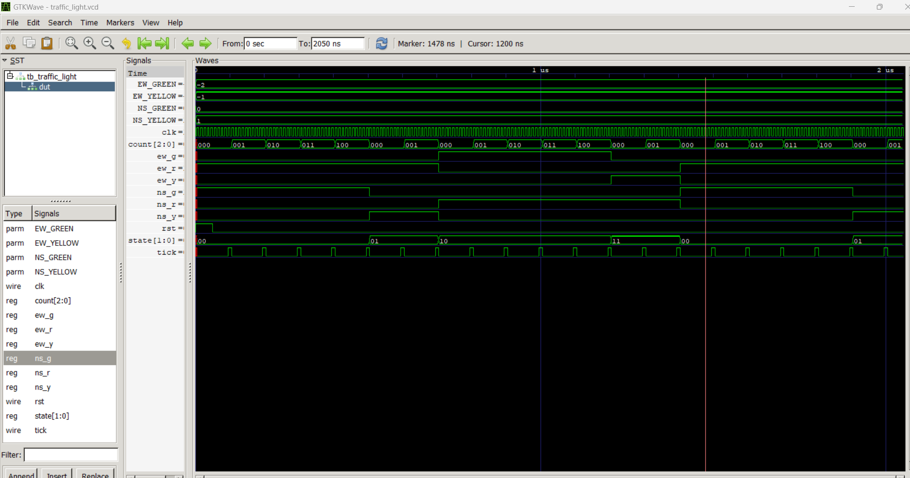

# Traffic Light System - Moore FSM

## Overview
This project implements a Moore finite state machine (FSM) to control traffic lights for two roads: North-South (NS) and East-West (EW).

**Timing Pattern**: NS Green (5 ticks) → NS Yellow (2 ticks) → EW Green (5 ticks) → EW Yellow (2 ticks) → repeat

## Files
- `traffic_light.v` - Main implementation with FSM and tick generator
- `tb_traffic_light.v` - Testbench for simulation

## What is "tick"?
**Tick** is a timing pulse that occurs once per second (1 Hz) in real hardware, but the traffic light FSM runs on a fast 50 MHz clock.

- **Real system**: 50 MHz clock → tick generator → 1 Hz tick (once per second)
- **Simulation**: 100 MHz testbench clock → tick every 10 cycles (for fast testing)
- **FSM**: Only changes state when tick = 1

## How 1 Hz Tick is Generated

**Process:**
1. Counter counts from 0 to 49,999,999 (50 million clock cycles)
2. When counter reaches 49,999,999, tick = 1 for exactly 1 cycle
3. Counter resets to 0 and process repeats
4. Result: tick pulse every 1 second


**Process:**
1. Count clock cycles: 0, 1, 2, 3, 4, 5, 6, 7, 8, 9, 10, 11...
2. tick = 1 when count is 9, 19, 29, etc.
3. tick = 0 all other times
4. Result: tick pulse every 100ns (instead of 1 second)

## State Diagram


## Moore FSM Features
- **Outputs depend only on current state** (not inputs)
- **Exactly one light active per road** at any time
- **Synchronous state transitions** on clock edge with tick enable
- **4 states**: NS_GREEN, NS_YELLOW, EW_GREEN, EW_YELLOW

## Running the Simulation
```bash
# Compile
iverilog -o sim.out traffic_light.v tb_traffic_light.v

# Run simulation
vvp sim.out

# View waveforms
gtkwave traffic_light.vcd
```

## Clock Frequencies
- **Hardware**: 50 MHz system clock → 1 Hz tick (50,000,000:1 ratio)
- **Simulation**: 100 MHz testbench clock → tick every 10 cycles (10:1 ratio)
- **Both produce same FSM behavior**, just different time scales

## Simulation

