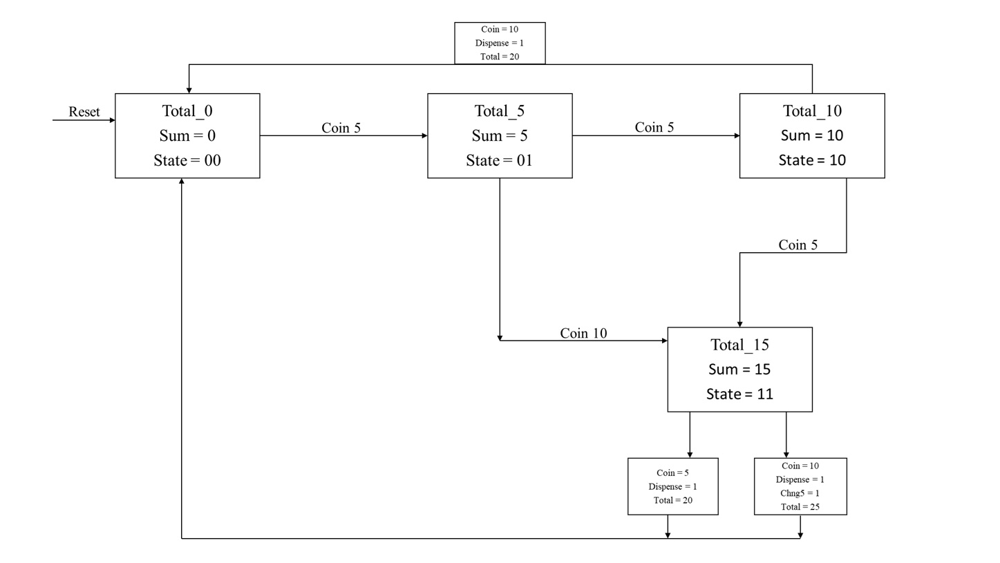
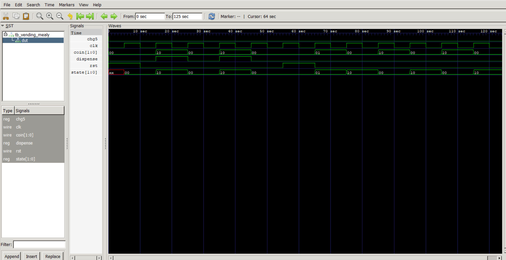

# Vending Machine with Change - Mealy FSM

A Verilog implementation of a vending machine finite state machine using Mealy architecture for CS322M FSM Assignment.

## Problem Statement

Design a vending machine that:
- **Price:** 20 units
- **Accepted Coins:** 5 or 10 units
- **Functionality:** Dispense product when total ≥ 20, provide change for overpayment
- **Reset:** Synchronous active-high reset
- **Architecture:** Mealy FSM (outputs depend on state + input)

## Specifications

### Coin Encoding
| `coin[1:0]` | Value | Description |
|-------------|-------|-------------|
| `00`        | -     | Idle (no coin) |
| `01`        | 5     | 5-unit coin |
| `10`        | 10    | 10-unit coin |
| `11`        | -     | Invalid (ignored) |

## State Machine Design



### Mealy Outputs
- **`dispense=1`:** Generated when payment ≥ 20 (exact or overpayment)
- **`chg5=1`:** Generated when payment = 25 (return 5 units change)
- **Duration:** Both outputs are 1-cycle pulses
- **Reset:** Automatic return to `TOTAL_0` after dispensing

##  Architecture Choice: Mealy FSM

### Why Mealy?
1. **Immediate Response:** Outputs available same clock cycle as input
2. **Fewer States:** No separate output states needed
3. **Real-time Operation:** Vending machines need instant dispensing
4. **Input-dependent Logic:** Outputs depend on current state AND input coin
5. **Efficient Design:** Combinational output logic with synchronous state transitions

## Quick Start

### Prerequisites
- Verilog simulator (ModelSim/Quartus/Icarus Verilog)
- GTKWave for waveform viewing

### Simulation
```bash
# Compile and run
iverilog -o sim.out vending_mealy.v tb_vending_mealy.v

vvp sim.out

# View waveforms
gtkwave vending.vcd
```

### Expected Output
```
t=15 state=2 coin=2 disp=1 chg=0    # 10+10=20 (exact payment)
t=25 state=0 coin=0 disp=0 chg=0    # Reset after vending
```


Course Assignment Implementation
