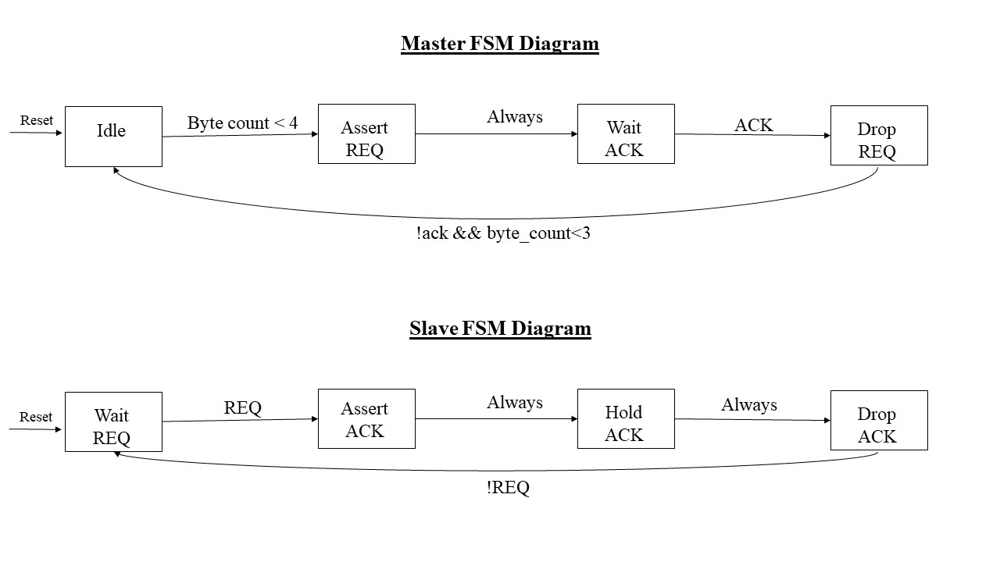
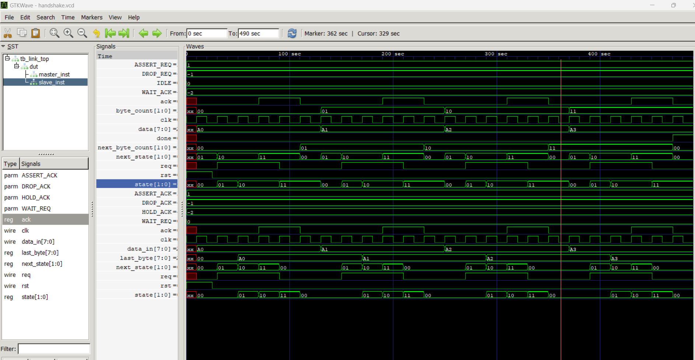

# Master-Slave Handshake FSM System

A Verilog implementation of a 4-phase handshake protocol between Master and Slave finite state machines using an 8-bit data bus.

## Overview

This project implements a Master-Slave communication system where:
- **Master** initiates data transfers for 4 bytes (A0, A1, A2, A3)
- **Slave** responds with acknowledgment and latches data
- **4-phase handshake** protocol ensures reliable data transfer
- **Mealy FSM** architecture for responsive timing


## 4-Phase Handshake Protocol

Each byte transfer follows this sequence:

1. **Phase 1**: Master drives data and raises `req`
2. **Phase 2**: Slave latches data on `req` and asserts `ack` (held for 2 cycles)
3. **Phase 3**: Master sees `ack` and drops `req`
4. **Phase 4**: Slave sees `req` drop and drops `ack`


### Running the Testbench
```bash
# Using Icarus Verilog
iverilog -o sim.out master_fsm.v slave_fsm.v link_top.v tb_link_top.v
vvp sim.out

# gtkwave
gtkwave handshake.vcd
```


## Waveform Analysis


## Design Decisions

### Why Mealy FSM?
- **Faster Response**: `done` asserts immediately when final `ack` drops
- **Input Sensitivity**: Data latching responds immediately to `req` rising


### 2-Cycle ACK Hold
- Ensures reliable `ack` detection by master
- Provides setup/hold margin for cross-clock domain signals

## Waveform

