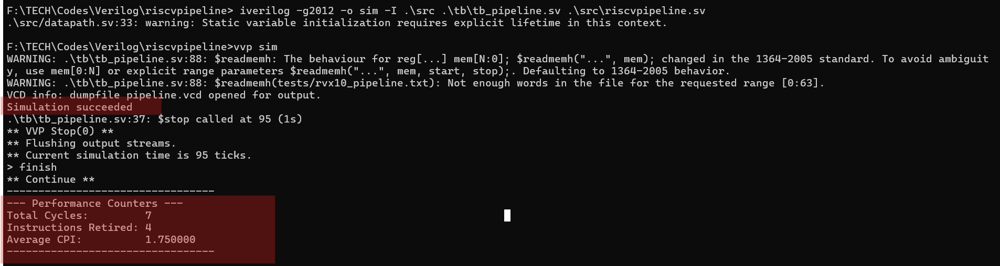
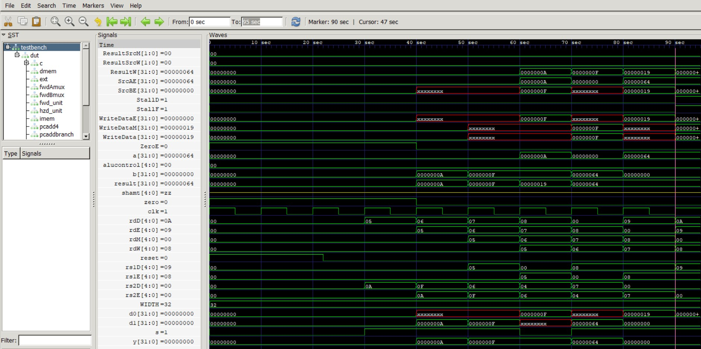
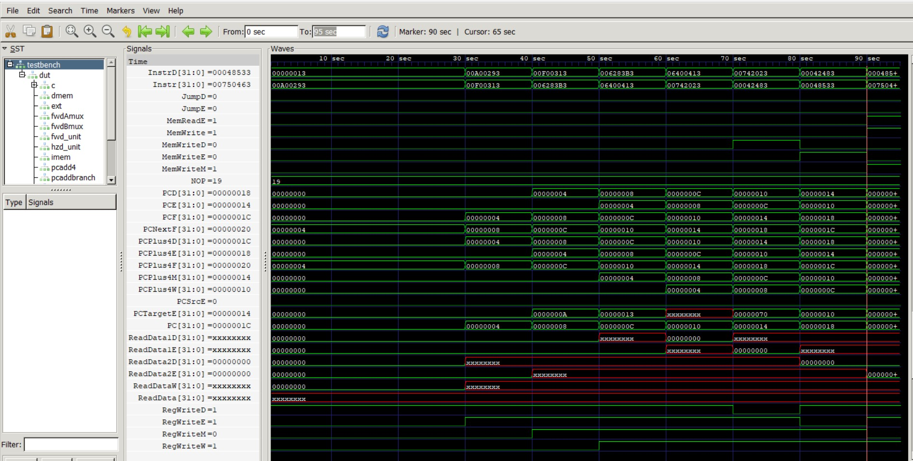
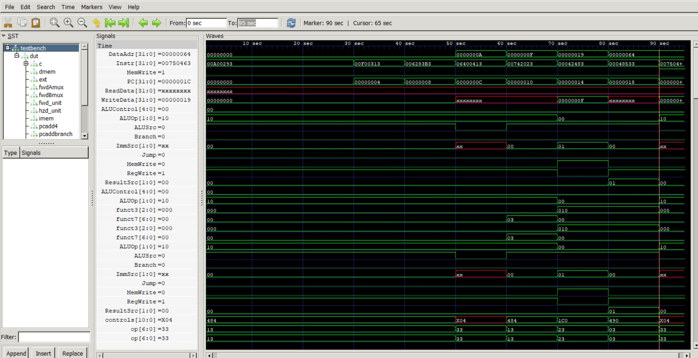
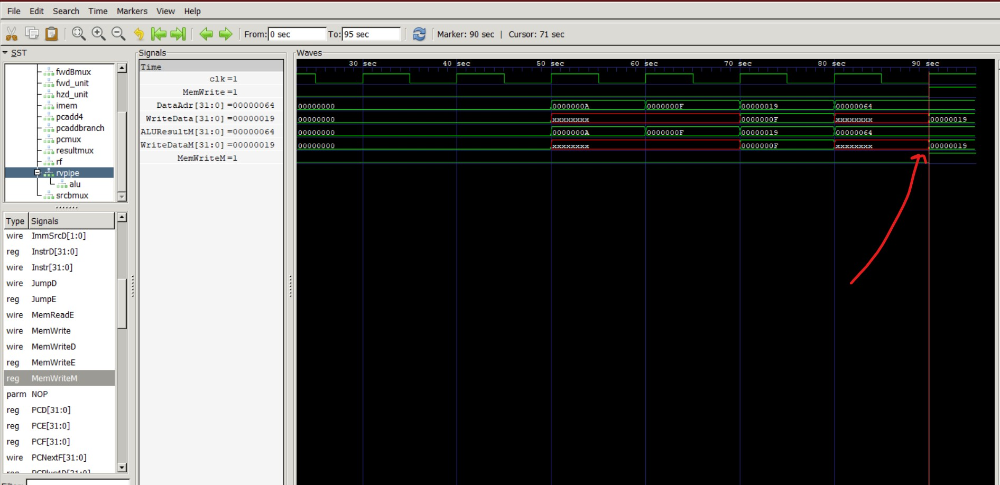
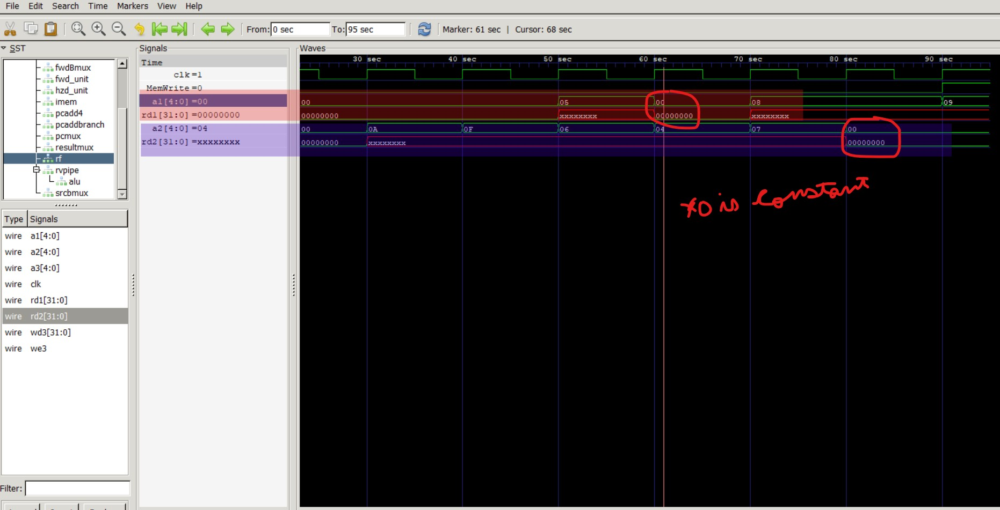
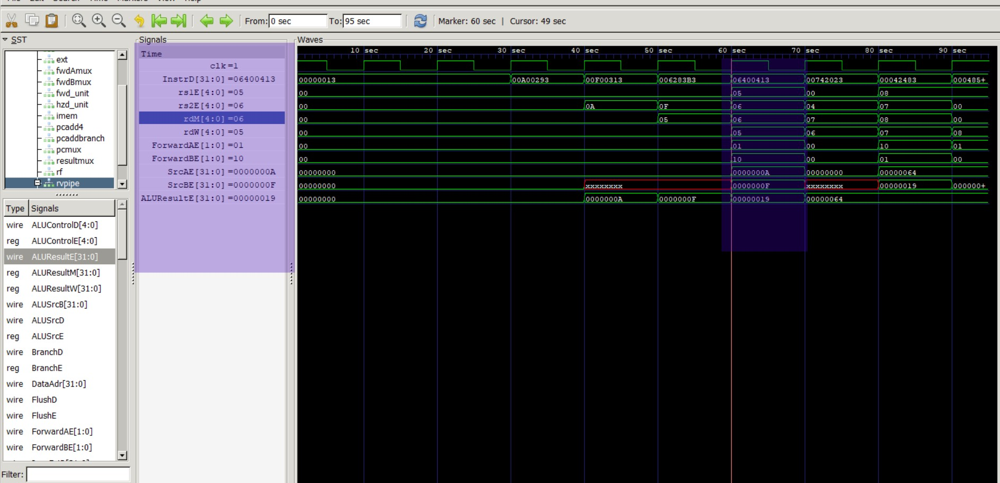
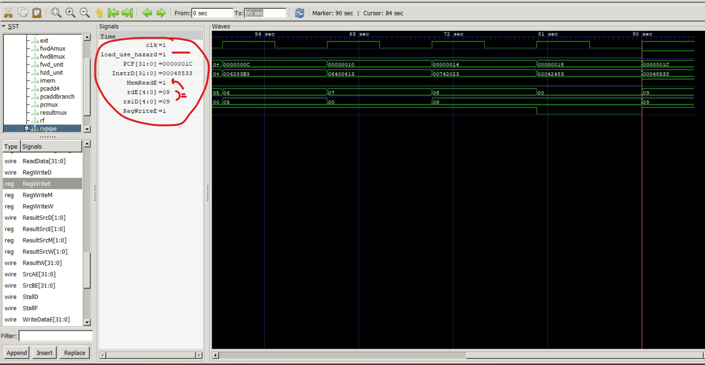

# OUTPUTS

## 1. Successful Simulation



The simulation is successful and with average CPI of 1.750

## 2. GTK Wave waveform for full processor





## 
## 3. The pipeline executes multiple instructions concurrently.


```
Stage    Signal    Value          Instruction It Belongs To
IF       PCF       0x1C           "beq x10, x7, skip (Being fetched)"
ID       InstrD    0x00042483     "lw x9, 0(x8) (Being decoded)"
EX       rdE       0              "sw x7, 0(x8) (Being executed, sw has no rd)"
MEM      rdM       8              "addi x8, x0, 100 (Accessing memory)"
WB       rdW       7              "add x7, x5, x6 (Writing back to x7)"
```


# Checklist Confirmation:

  ## 1. Single test program finishes with store of 25 to memory address 100.
  
  

   ## 2. x0 register remains constant at zero.
  

   ## 3. Forwarding verified for back-to-back ALU ops.
  
  The add instruction needs the results from x5 and x6, which are being calculated by the two immediately preceding instructions. Without forwarding, this would require two stalls. ALUResultE compute the value 25 (or 0x19) in that same cycle. This proves that the data was successfully forwarded from two different pipeline stages (MEM and WB) simultaneously to prevent any stalls.

 ## 4. One-cycle stall correctly inserted for load-use. .
  
  The add instruction (in the ID stage) needs the value of x9, but the lw instruction (in the EX stage) won't have that data until it finishes its MEM stage. The hazard_unit detects this and stalls the pipeline.
